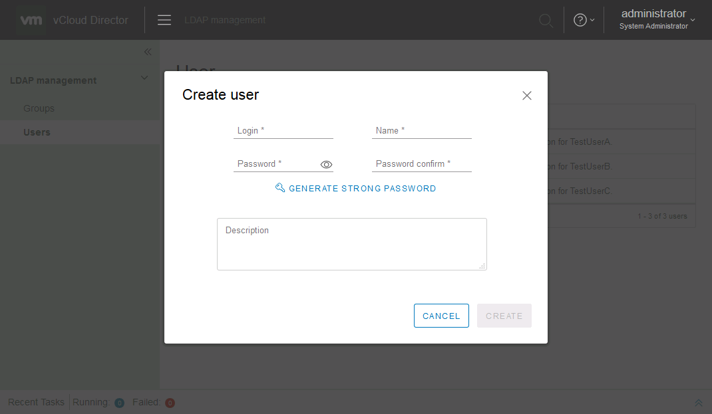

# LDAP user management extension for vCloud Director >=9.1

LUMext is a vCD UI & API extension to manage LDAP-based organisation's users and groups through *VMware vCloud Director*.

This extension aims to provide a way to share a single LDAP server for multiple organisations to simplify the user management.

## Scope

A this time, the extension supports only **users management** with the following actions available:

* List users
* Create user
* Edit user
* Reset password
* Delete user

In future releases, we plan to provide a support for LDAP **groups** to simplify the role management.

### Screenshots




## How does it works ?

### Components

LUMExt is based on a the [vCloud Director Extension SDK](https://github.com/vmware/vcd-ext-sdk) and relies on the following components:

* An existing vCloud Director instance
* An existing LDAP compatible server (Active Directory is supported)
* A RabbitMQ server. API requests from vCD's extensions are forwarded to RabbitMQ, then consumed by the backend part of the extension.
* A backend server: `LUMExt-api` (A python module that consumes messages from RabbitMQ).
* UI/API Extensions, uploaded to vCD API.

### Architecture

The following architecture is used for LUMExt deployement


### LDAP structure

As the goal of LUMExt for vCloud Director is to provide the ability to manage per-organization's users in a shared LDAP directory, a common structure is required.

We choose to use the following one to map both users and group to organizations:

```
LDAP Directory root/
└── Base OU
    ├── Org1-OU
    │   ├── Groups
    │   └── Users
    ├── Org2-OU
    │   ├── Groups
    │   └── Users
    └── Org3-OU
        ├── Groups
        └── Users
```

Each Organization's OU is named according to the Org-ID (ex: `5eb80c89-06bc-4650-b5e2-25d5d4972e70`) and contains two sub-OU: `Users` & `Groups`. Currently, only `Users` sub-OU is used by the extension.

*Base OU* can be configured in the settings of LUMExt API service to point in a specific point of the LDAP directory based on its LDAP path.

## LUMExt-API

*LUMExt-API* is the backend server used to:

1. Catch messages from the RabbitMQ server.
2. Made the appropriate action(s) on LDAP server (search, edition, creation...).
3. Send back answer to the initial request.

### Installation

In the following documentation, we will see how-to deploy the LUMExt-API in a vCloud Director virtual appliance OS (to avoid deploying a new VM to host it)

> This deployement method is not a best-practice one. Consider to deploy a new VM to host this specific application for production purpose. You can use the same process to deploy the LUMExt-API to a non vCD VA VM.

Firstly, connect by SSH to the VM that will host the API (a vCD Cell in our case).

#### Pre-requisites & installation

```bash
# Install git
yum install git

# Create env variable
echo "export LUMEXT_HOME=/opt/sii/lumext" > /etc/profile.d/lumext.sh
echo "export LUMEXT_CONFIGURATION_FILE_PATH=/opt/sii/lumext/etc/config.json" >> /etc/profile.d/lumext.sh
chmod 755 /etc/profile.d/lumext.sh

# Create folder structure
mkdir -p $LUMEXT_HOME/etc
cd $LUMEXT_HOME

# Create python virtual env
python3 -m venv lumext-venv
. lumext-venv/bin/activate

# Get LUMExt code
git clone https://github.com/groupe-sii/lumext.git lumext-app

# Install python requirements
cd $LUMEXT_HOME/lumext-app/api
pip install .
```

#### Configuration

Before running LUMExt-API, it is necessary to configure it.

```bash
# Copy configuration sample
cp config.sample.json $LUMEXT_CONFIGURATION_FILE_PATH
# Copy log configuration (so you will be able to edit it for your purpose)
cp logging.json $LUMEXT_HOME/etc
```

Then you will need to edit the following line of the `/opt/sii/lumext/etc/config.json` file:

```json
{
    "rabbitmq": {
        "server": "<address of rmq server>",
        "port": "<tcp port of rmq server>",
        "user": "<amqp username>",
        "password": "<amqp password>",
        "exchange": "<configured exchange on vCD>",
        "queue": "sii-lumext",
        "routing_key": "sii-lumext",
        "use_ssl": true // true/false depending on your rmq server
    },
    "ldap": {
        "address": "ldaps://---------:636", // ldap address starting with ldap:// or ldaps://
        "user": "user@domain", // username for LDAP administration
        "secret": "<ldap user password>",
        "base": "dc=domain,dc=tld", // LDAP base path to use as a root for OU creation(s)
        "domain": "domain.tld", // name of the LDAP domain
        "search_timeout": 5, // seconds
        "operation_timeout": 5, // seconds
        "cacert_file": "/etc/ssl/certs/ca-certificates.crt", // If LDAPs is used
        "userAccountControl": 66048 // Default mode for user creation (66048: no password expiration + user activated)
    },
    "log": {
        "config_path": "/opt/sii/lumext/etc/logging.json" // path to the log configuration file
    }
}
```

> Remove all ``//.*`` comments as it it not supported in JSON syntax.

#### Test

Once configured, you can test in foreground mode that the API is well starting as expected:

```bash
lumext
```

Depending on the chosen log level for console, some informations are available to confirm that the start of API backend in foreground mode:

```
2019-04-12 12:50:20     INFO    MainThread      lumext_api.__main__     Starting API server
2019-04-12 12:50:20     INFO    MainThread      VcdExtMessageWorker     New listener initialized for exchange/queue: systemExchange/sii-lumext...
2019-04-12 12:50:20     INFO    MainThread      kombu.mixins    Connected to amqp://rmq-svc:**@rbmq:5671//
```

`CTRL+c` to leave.

#### Install LUMExt API as-a-service

For production or regular basis usage, it is necessary to start the LUMExt API as a daemon (in background mode).

On a system using **systemd**:

Create the `/etc/systemd/system/sii_lumextapi.service` file with the following content:

```ini
[Unit]
Description="LUMExt API - Backend for LUMExt for vCD"
After="network-online.target"

[Service]
Environment="LUMEXT_HOME=/opt/sii/lumext"
Environment="LUMEXT_CONFIGURATION_FILE_PATH=/opt/sii/lumext/etc/config.json"
WorkingDirectory=/opt/sii/lumext
ExecStart=/opt/sii/lumext/lumext-venv/bin/python -m lumext_api
Restart=on-failure
RestartSec=5
User=root
Group=root
TimeoutStopSec=30

[Install]
WantedBy=multi-user.target
```

Reload `systemd`, enable and start the service:

```bash
# Reload `systemd`
systemctl daemon-reload
# Enable service
systemctl enable sii_lumextapi
# Start it
service sii_lumextapi start
```

## LUMExt-UI and API extension

### Deploy UI extension

LUMExt-UI is a vCloud Director plugin that extends the HTML5 UI. Once deployed, a new item will be available in the main menu of vCloud Director for tenants where the extension is published to.

#### Download plugin

Please download the last version of `plugin.zip` from the releases files of the github project: [lumext/release](https://github.com/groupe-sii/lumext/releases/latest), copy it to the `ui` folder of the project clone.

#### from vCD >=9.1 to 9.5

Use the provided script from the `ui` folder to deploy the LUMExt-UI plugin in vCloud Director.

```bash
cd ui # from root ot the github repository clone
python ./ui_ext_api.py --user "administrator" \
                       --password '******' \
                       --server "vcd.domain" \
                       --folder ./ \
                       deploy
```

#### Since vCD 9.7

Since vCloud Director 9.7, a new plugin name `Customize Portal` enable the plugin management from the HTML5 Provider UI.

Use the `upload` button to upload the `plugin.zip` file. Review the scope of the plugin:

* *Service Provider* to enable the plugin in the *System* organization.
* *Tenants* to enable the plugin for other organizations.

It is also possible to chose to publish the extension for all, or some tenants only.

Then submit the upload process.

### Deploy API extension

LUMExt also relies on the capacity of vCloud Director API to be extended. So, the UI plugin (or any other API tools) will be able to use the `api` path of vCloud Director to access/create/edit LUMExt objects.

In order to deploy this API extension, use the following script from the `ui` folder:

```bash
cd ui # from root ot the github repository clone
python ./deploy_api.py --user "administrator" \
                       --password '******' \
                       --server "vcd.domain" \
                       --extension_file ./extension.xml \
                       --extension_name "Lumext" \
                       deploy
```

## Usage

### Pre-requisites

#### RabbitMQ AMQP broker

In order to work, LUMExt requires that the vCloud Director instance is configured with a RabbitMQ server.

Please refer to the [vCloud Director's documentation](https://docs.vmware.com/en/vCloud-Director/9.7/com.vmware.vcloud.install.doc/GUID-8E4DD1BC-E038-499B-B1FD-02A05E1689AF.html?hWord=N4IghgNiBcIE5gEaIJYBcC2BHEBfIA) to setup the RabbitMQ AMQP broker.


#### LDAP configuration for vCloud Director

To be usable in vCloud Director context, LDAP directory must be addedd as a *system* or *by-organization* source of authentication.

We recommend that:

* You setup up the LDAP directory at system level.
* Refer to the same configuration at organization level with a different base path for users lookup.

**For example:**

At *System* level:


At organization level:


#### User import

Once a user is created on LUMExt extension, you can import it at organization's level through the *Access control* section, *Users* subsection and `Import users` button:


#### User connection

According to the chosen role attributed to the user created through the extension, it is possible to use the account for login process in vCloud Director.